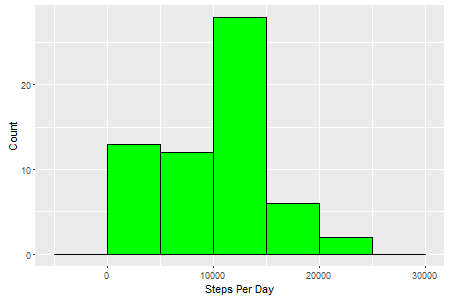
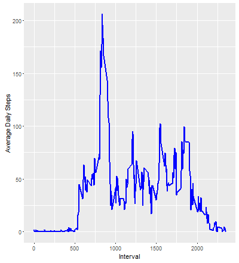
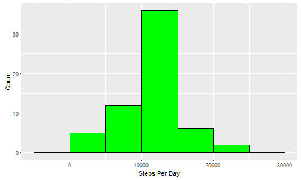
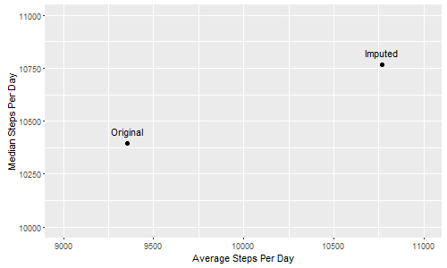
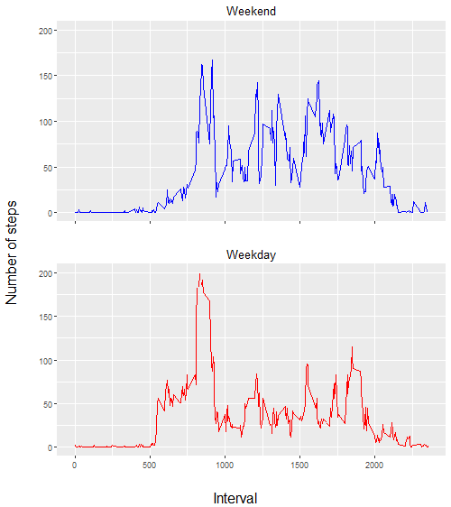

***
## Loading and preprocessing the data


Install necessary packages
```{r eval=FALSE}

if(!require(ggplot2)) install.packages("ggplot2")
require(ggplot2)

if(!require(gridExtra)) install.packages("gridExtra")
require(gridExtra)

if(!require(data.table)) install.packages("data.table")
require(data.table)
```

Download and extract file
```r
fileurl <- "https://d396qusza40orc.cloudfront.net/repdata%2Fdata%2Factivity.zip"
filen <- "repdata-data-activity"
download.file(fileurl, paste0(filen,".zip"), mode = "wb")
unzip(paste0(filen, ".zip"),"activity.csv")
```
Load data into a data.table object
```r
actfn <- "activity.csv"
activity <- fread(actfn, sep = "auto", colClasses = c("numeric", "charachter", "numeric"))
```
Convert values in [date] to date-type values
```r
activity$date <- as.Date(activity$date)
```

***
## What is mean total number of steps taken per day?

Total Number of Steps taken per day
```{r eval=FALSE, echo=TRUE}
stepsperday <- activity[,.(StepsPerDay=sum(steps, na.rm = TRUE)), by = date]
```

Histogram of Steps Per Day frequency with bin width of 1000
```r
ggplot(stepsperday, aes(StepsPerDay)) + geom_histogram(binwidth = 5000, color = "black", fill = "green") + 
  xlab("Steps Per Day") +
  ylab("Count")
```
 

Mean and Median of the total number of steps taken each day:  
**Mean:   9354.23**  
**Median: 10395**
```r
stepsperday.stats <- stepsperday[,.(StepsPerDay_Mean = mean(StepsPerDay, na.rm = TRUE), StepsPerDay_Median = median(StepsPerDay))]

stepsperday.stats$StepsPerDay_Mean
stepsperday.stats$StepsPerDay_Median
``` 
***
## What is the average daily activity pattern?

Calculate and plots for average daily activity pattern.
Time series plot of average number of steps taken per day:
```{r eval=FALSE, echo=TRUE}
StepsPerInt <- activity[,.(AveragePerInterval = mean(steps, na.rm = TRUE)), by = interval]

ggplot(StepsPerInt, aes(interval, AveragePerInterval)) + geom_line(color = "blue", size = 1) + 
  xlab("Interval") + 
  ylab("Average Daily Steps")
```
 

The 5-minute interval, on average across all the days in the data set, that contains the maximum number of steps:  
**835**
```{r eval=FALSE, echo=TRUE}
StepsPerInt[AveragePerInterval == max(AveragePerInterval), interval]
```

***
## Imputing missing values

Total number of missing values in the data set (i.e. the total number of rows with NAs):  
**2304**
```{r eval=FALSE, echo=TRUE}
sum(is.na(activity))
```

Strategy for imputing missing values: Use average value per interval to replace NAs
Create a new data set that is equal to the original data set but with the missing data filled in.
```r
activity.imp <- as.data.table(merge(activity, StepsPerInt, by = "interval"))[is.na(steps), 
                                      steps := AveragePerInterval][,AveragePerInterval:=NULL]
```

Histogram of Steps per Day for the data set with imputed values  
 

Both the mean and the median for the imputed values are higher  

 StepsPerDay-Mean|StepsPerDay-Median|Data Source
 ----------------|------------------|----------
  9354.23        |          10395.00| Original
  10766.19       |          10766.19| Imputed


 

```r
ggplot(statsperday.all, aes(x=StepsPerDay_Mean, y=StepsPerDay_Median, label = DataSource)) + 
  geom_text(hjust = 0.5, vjust= -1, nudge_x = 0) + geom_point(size=2) +
  expand_limits(x=c(9000, 11000), y=c(10000, 11000)) + xlab("Average Steps Per Day") + ylab("Median Steps Per Day")
```
***
## Are there differences in activity patterns between weekdays and weekends?

Split the data set into weekend and weekday data.tables

```r
activity.daytype <- activity.imp[,TypeOfWday:=as.factor(ifelse(weekdays(date)=="Saturday"|weekdays(date)=="Sunday", 
                                                               "Weekend", "Weekday"))]

wkend <- activity.daytype[TypeOfWday=="Weekend",.(StepsPerInt=mean(steps)), by = interval]
wkday <- activity.daytype[TypeOfWday=="Weekday",.(StepsPerInt=mean(steps)), by = interval]
```
Create weekend plot
```r
plot1 <- ggplot(wkend, aes(x=interval, y = StepsPerInt)) + 
  geom_line(color = "blue") + 
  xlab("") + ylab("") + 
  theme(axis.text.x = element_blank()) +
  ylim(0,200)+
  ggtitle("Weekend")
```
Create weekday plot
```r
plot2 <- ggplot(wkday, aes(x=interval, y = StepsPerInt)) + 
  geom_line(color = "red") + 
  xlab("") + ylab("") +
  ylim(0,200) +
  ggtitle("Weekday")
```
Combine the plots above

```r
grid.arrange(plot1, plot2, nrow=2,left = "Number of steps", bottom = "Interval")
```
 
